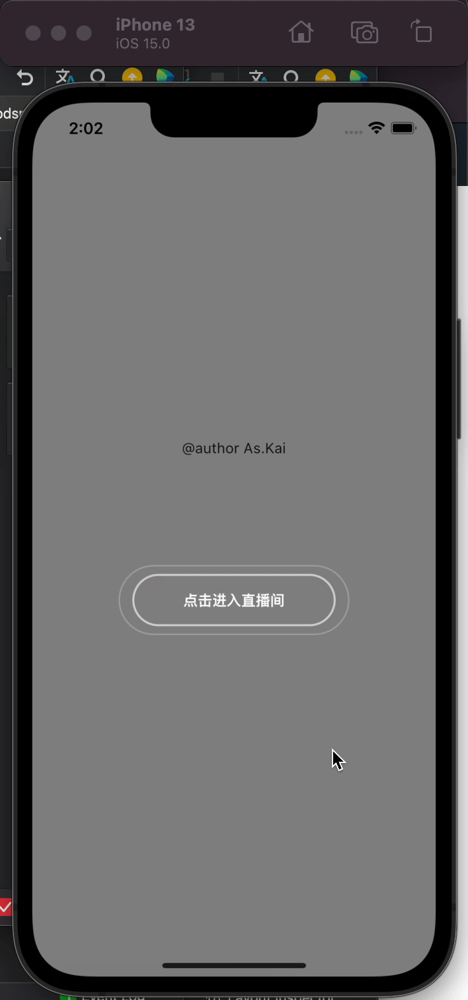

## askai_animation_button

Imitation TikTok of Live button.

### HOW TO USE
>add "askai_animation_button: ^last version" to the pubspec.yaml
> ```
> dependencies:
>   askai_animation_button: ^last version
>```

### use
[see also](https://pub.dev/packages/askai_animation_button/example)
```
const KaiAnimationButton(
      {Key? key,
      required this.text,   //text inside button
      required this.innerCircleColor,   //innerCircle's Color. [begin,end]
      required this.outerRingColor,     //outerRing's Color. [begin,end]
      this.style,   //TextStyle
      required this.onTap,  
      required this.innerWidth, //innerCircle's width. [begin,end]
      required this.outerRingWidth, //outerRing's width. [begin,end]
      required this.outerRingHeight})   //outerRing's height. [begin,end]
      : super(key: key);
```

### rendering


### If you have plublem and more,please to contact me.
### or Submit questions to '[issues](https://github.com/adminKKi/askai_animation_button/issues)'


## Getting Started

This project is a starting point for a Flutter
[plug-in package](https://flutter.dev/developing-packages/),
a specialized package that includes platform-specific implementation code for
Android and/or iOS.

For help getting started with Flutter, view our
[online documentation](https://flutter.dev/docs), which offers tutorials,
samples, guidance on mobile development, and a full API reference.

